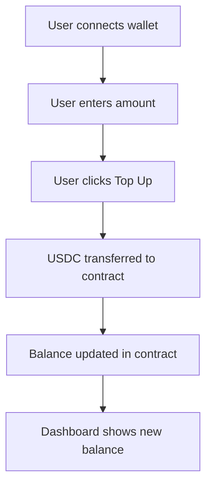
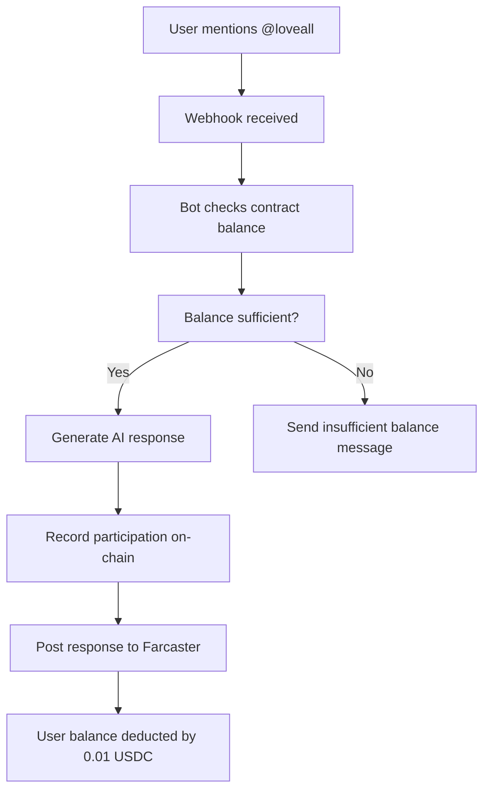
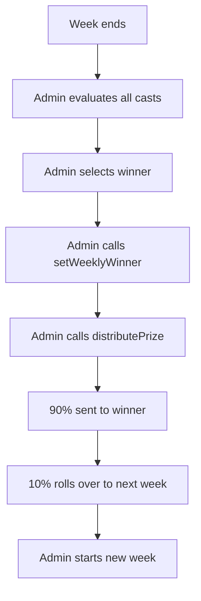

# 🥰 Loveall - Farcaster Flirting Bot

A gamified flirting bot for Farcaster that rewards users for engaging conversations with weekly prize pools and AI-powered responses.

## 📋 Table of Contents

- [Overview](#overview)
- [Features](#features)
- [Technical Stack](#technical-stack)
- [Smart Contract](#smart-contract)
- [Bot Architecture](#bot-architecture)
- [Frontend](#frontend)
- [API Endpoints](#api-endpoints)
- [User Flow](#user-flow)
- [Installation](#installation)
- [Configuration](#configuration)
- [Deployment](#deployment)
- [Security](#security)
- [Contributing](#contributing)

## 🌟 Overview

Loveall is a sophisticated flirting bot for Farcaster that creates an engaging, gamified experience where users pay 1 cent (0.01 USDC) per cast to interact with the bot. The system features weekly prize pools, AI-powered responses using Grok AI, and a modern dark-themed web interface for user management.

### 🎯 Key Concepts

- **Pay-to-Chat:** Users pay 0.01 USDC per cast to interact with the bot
- **Weekly Prize Pools:** 90% of collected fees go to weekly winners, 10% rolls over
- **AI-Powered Responses:** Grok AI generates contextual, flirty responses
- **Participation Limits:** Users can participate multiple times per week (no weekly limit)
- **Smart Contract Management:** All balances and prizes managed on-chain

## ✨ Features

### 🤖 Bot Features
- **Multi-wallet Support:** Detects and processes multiple connected wallets
- **RPC Fallback & Retry:** Robust blockchain interaction with multiple RPC endpoints
- **Contextual Responses:** AI-generated flirty responses based on user messages
- **Participation Tracking:** Records all interactions on-chain
- **Balance Management:** Checks contract balances (not wallet balances)

### 💻 Frontend Features
- **Dark Theme:** Modern, eye-friendly dark interface
- **User Dashboard:** Balance management, participation history, top-up/withdraw
- **Admin Dashboard:** Prize pool management, winner selection, contract administration
- **Real-time Updates:** Live balance and status updates
- **Wallet Integration:** Seamless RainbowKit wallet connection

### 🔗 Smart Contract Features
- **Balance Management:** Users top-up contract balances for participation
- **Prize Pool Accumulation:** Automatic fee collection and prize pool building
- **Weekly Cycles:** Configurable weekly periods for prize distribution
- **Optimized RPC Calls:** Efficient view functions for frontend integration
- **Security Features:** Ownable, Pausable, ReentrancyGuard protection

## 🛠️ Technical Stack

### Frontend
- **Framework:** Next.js 15.4.6 with TypeScript
- **Styling:** Tailwind CSS with dark theme
- **Wallet Integration:** RainbowKit & Wagmi
- **Blockchain:** Base Network (Ethereum L2)

### Backend
- **Runtime:** Node.js
- **API:** Next.js API Routes
- **Blockchain Interaction:** Ethers.js
- **AI Integration:** Grok AI API

### Smart Contract
- **Language:** Solidity ^0.8.20
- **Network:** Base Mainnet
- **Token:** USDC (6 decimals)
- **Security:** OpenZeppelin contracts (Ownable, Pausable, ReentrancyGuard)

### External Services
- **Farcaster Integration:** Neynar SDK v3.34.0
- **Deployment:** Vercel
- **Blockchain:** Base Network

## 🏗️ Smart Contract

### Contract Address
```
0x79C495b3F99EeC74ef06C79677Aee352F40F1De5 (Base mainnet)
```

### Core Economics
```solidity
uint256 public constant CAST_COST = 1e4;           // 0.01 USDC (1 cent)
uint256 public constant WINNER_PERCENTAGE = 90;    // 90% to winner
uint256 public constant ROLLOVER_PERCENTAGE = 10;  // 10% rollover
uint256 public constant WEEK_DURATION = 2 hours;   // Weekly cycle (for testing)
```

### Key Functions

#### User Functions
```solidity
// Top-up contract balance
function topUp(uint256 amount) external

// Withdraw unused balance
function withdrawBalance(uint256 amount) external

// Get user data (optimized)
function getUserData(address user) external view returns (UserData memory)
```

#### Bot Functions
```solidity
// Record user participation (bot only)
function participateInCast(address user, bytes32 castHash) external onlyOwner
```

#### Admin Functions
```solidity
// Set weekly winner
function setWeeklyWinner(address winner) external onlyOwner

// Distribute prize to winner
function distributePrize() external onlyOwner

// Start new week
function startNewWeek() external onlyOwner
```

#### View Functions
```solidity
// Get all common data (admin dashboard)
function getCommonData() external view returns (CommonData memory)

// Get multiple users' data
function getMultipleUsersData(address[] calldata users) external view returns (UserData[] memory)

// Get weekly summary
function getWeeklySummary(uint256 week) external view returns (address[] participants, address winner, uint256 prize, uint256 participantsCount)
```

### Data Structures

#### Cast Participation
```solidity
struct CastParticipation {
    address user;        // User who participated
    bytes32 castHash;    // Hash of the Farcaster cast
    uint256 timestamp;   // When participation occurred
    uint256 weekNumber;  // Which week
    uint256 usdcAmount;  // Amount paid (0.01 USDC)
    bool isEvaluated;    // Whether Grok AI evaluated this cast
}
```

#### User Data
```solidity
struct UserData {
    uint256 balance;                    // User's contract balance
    bool hasSufficientBalance;          // Can participate (≥ 0.01 USDC)
    bool hasParticipatedThisWeek;       // Has participated this week
    uint256 participationsCount;        // Number of participations this week
    CastParticipation[] participations; // Participation history
}
```

#### Common Data
```solidity
struct CommonData {
    uint256 totalPrizePool;             // Total ever accumulated
    uint256 currentWeekPrizePool;       // Current week's pool
    uint256 rolloverAmount;             // Amount rolling to next week
    uint256 currentWeek;                // Current week number
    uint256 weekStartTime;              // When current week started
    uint256 weekEndTime;                // When current week ends
    uint256 currentWeekParticipantsCount; // Number of participants this week
    address currentWeekWinner;          // Current week's winner
    uint256 currentWeekPrize;           // Current week's prize amount
}
```

## 🤖 Bot Architecture

### Core Components

#### 1. Webhook Processing
- **Endpoint:** `/api/bot-new/mention`
- **Trigger:** Farcaster mentions to @loveall
- **Processing:** Multi-wallet detection, balance checking, response generation

#### 2. Balance Checking
```typescript
// Multi-wallet support with RPC fallback
const checkUserBalance = async (userAddresses: string[]) => {
  for (const address of userAddresses) {
    const balance = await checkSingleAddressBalance(address);
    if (balance.hasBalance) {
      return { bestAddress: address, ...balance };
    }
  }
  return { insufficientBalance: true };
};
```

#### 3. Response Generation
```typescript
// Grok AI integration for contextual responses
const generateResponse = async (castText: string, threadContext: string) => {
  const prompt = `Generate a flirty, engaging response to: "${castText}"`;
  const response = await grokAI.generate(prompt);
  return response;
};
```

#### 4. Participation Recording
```typescript
// On-chain participation recording
const recordParticipation = async (userAddress: string, castHash: string) => {
  const botWallet = new ethers.Wallet(process.env.PRIVATE_KEY, provider);
  const contract = new ethers.Contract(CONTRACT_ADDRESS, CONTRACT_ABI, botWallet);
  
  const castHashBytes32 = ethers.keccak256(ethers.toUtf8Bytes(castHash));
  const tx = await contract.participateInCast(userAddress, castHashBytes32);
  return await tx.wait();
};
```

### RPC Optimization
- **Multiple Endpoints:** Fallback to different RPC providers
- **Retry Logic:** Exponential backoff for failed requests
- **Single Call Data:** Optimized view functions reduce RPC calls from 3 to 1

## 🎨 Frontend

### User Dashboard
- **Balance Management:** Top-up and withdraw functionality
- **Participation History:** Complete history of all interactions
- **Status Indicators:** Clear participation status with detailed reasons
- **Real-time Updates:** Live balance and transaction status

### Admin Dashboard
- **Prize Pool Overview:** Current pool, rollover, total participants
- **Winner Management:** Set winners and distribute prizes
- **Contract Administration:** Start new weeks, manage contract state
- **Transaction Tracking:** Monitor all contract interactions

### Dark Theme Implementation
```css
/* Modern dark theme with purple accents */
.bg-gray-800 { background-color: #1f2937; }
.border-purple-500\/30 { border-color: rgba(168, 85, 247, 0.3); }
.text-pink-400 { color: #f472b6; }
```

## 🔌 API Endpoints

### Working Endpoints
- `GET /api/health` - Health check
- `GET /api/simple` - Simple test endpoint
- `GET /api/check-balance` - User balance and participation status
- `GET /api/admin-data` - Admin dashboard data
- `GET /api/weekly-winners` - Weekly winners history
- `POST /api/bot-new/mention` - Bot webhook endpoint

### Example API Response
```json
{
  "address": "0x...",
  "contractBalance": "0.99",
  "hasSufficientBalance": true,
  "hasParticipatedThisWeek": false,
  "participationsCount": 0,
  "participations": [],
  "canParticipate": true,
  "requiredAmount": "0.01",
  "timestamp": "2025-01-13T08:30:00.000Z"
}
```

## 🔄 User Flow

### 1. User Top-Up Process


### 2. Bot Interaction Flow


### 3. Weekly Prize Distribution


## 🚀 Installation

### Prerequisites
- Node.js 18+
- npm or yarn
- Base network wallet with USDC
- Neynar API key
- Grok AI API key

### Setup
```bash
# Clone repository
git clone <repository-url>
cd loveall

# Install dependencies
npm install

# Set up environment variables
cp .env.example .env.local
```

### Environment Variables
```env
# Blockchain
PRIVATE_KEY=your_contract_owner_private_key
BASE_RPC_URL=https://mainnet.base.org
CONTRACT_ADDRESS=0x79C495b3F99EeC74ef06C79677Aee352F40F1De5
USDC_ADDRESS=0x833589fCD6eDb6E08f4c7C32D4f71b54bdA02913

# Farcaster
NEYNAR_API_KEY=your_neynar_api_key
NEYNAR_CLIENT_ID=your_neynar_client_id
NEYNAR_SIGNER_UUID=your_neynar_signer_uuid

# AI
GROK_API_KEY=your_grok_api_key

# Webhook
WEBHOOK_TARGET_URL=https://your-domain.vercel.app/api/bot-new/mention
WEB_HOOK_ID=your_webhook_id
WEBHOOK_SECRET=your_webhook_secret
```

## ⚙️ Configuration

### Neynar Webhook Setup
1. Create webhook in Neynar dashboard
2. Set target URL to `/api/bot-new/mention`
3. Configure event type: `cast.created`
4. Set text filter: `@loveall|@Loveall|@LOVEALL`

### Contract Deployment
```bash
# Deploy to Base mainnet
npx hardhat deploy --network base

# Verify contract
npx hardhat verify --network base <contract-address> <usdc-address> <owner-address>
```

## 🌐 Deployment

### Vercel Deployment
```bash
# Deploy to Vercel
vercel --prod

# Set environment variables in Vercel dashboard
```

### Contract Verification
- Contract is verified on BaseScan
- All functions are publicly accessible
- ABI is available for frontend integration

## 🔒 Security

### Smart Contract Security
- **Ownable:** Only owner can call admin functions
- **Pausable:** Contract can be paused in emergencies
- **ReentrancyGuard:** Prevents reentrancy attacks
- **Input Validation:** All inputs are validated
- **Transfer Safety:** All USDC transfers are validated

### API Security
- **Environment Variables:** All sensitive data in environment variables
- **Input Validation:** All API inputs are validated
- **Error Handling:** Comprehensive error handling without exposing internals
- **Rate Limiting:** Built-in rate limiting for API endpoints

### Frontend Security
- **Wallet Integration:** Secure wallet connection via RainbowKit
- **Transaction Signing:** All transactions require user approval
- **Network Validation:** Ensures users are on correct network (Base)

## 📊 Performance

### RPC Optimization
- **Single Call Data:** `getCommonData()` and `getUserData()` reduce RPC calls
- **Batch Operations:** `getMultipleUsersData()` for efficient processing
- **Fallback Endpoints:** Multiple RPC endpoints for reliability

### Frontend Performance
- **Real-time Updates:** Live data without page refreshes
- **Optimized Rendering:** Efficient React components
- **Caching:** Smart caching for frequently accessed data

## 🧪 Testing

### Contract Testing
```bash
# Run contract tests
npx hardhat test

# Run specific test file
npx hardhat test test/LoveallPrizePool.test.js
```

### API Testing
```bash
# Test API endpoints
curl https://your-domain.vercel.app/api/health
curl https://your-domain.vercel.app/api/check-balance?address=0x...
```

### Bot Testing
```bash
# Test webhook locally
ngrok http 3000
# Update webhook URL in Neynar dashboard
```

## 📈 Monitoring

### Contract Events
- `BalanceToppedUp` - User topped up balance
- `BalanceWithdrawn` - User withdrew balance
- `CastParticipated` - User participated in cast
- `WinnerSelected` - Weekly winner selected
- `PrizeDistributed` - Prize distributed to winner
- `NewWeekStarted` - New week started

### API Monitoring
- Health check endpoint for uptime monitoring
- Error logging for debugging
- Performance metrics for optimization

## 🤝 Contributing

### Development Setup
1. Fork the repository
2. Create a feature branch
3. Make your changes
4. Add tests if applicable
5. Submit a pull request

### Code Style
- Use TypeScript for all new code
- Follow ESLint configuration
- Add JSDoc comments for functions
- Use meaningful variable names

## 📄 License

This project is licensed under the MIT License - see the [LICENSE](LICENSE) file for details.

## 🆘 Support

### Common Issues
1. **Insufficient Balance:** Top up your contract balance via the dashboard
2. **Wrong Network:** Ensure you're connected to Base network
3. **Transaction Failed:** Check gas fees and try again
4. **Bot Not Responding:** Check webhook configuration

### Contact
- **Discord:** [Loveall Community](https://discord.gg/loveall)
- **Twitter:** [@loveall_bot](https://twitter.com/loveall_bot)
- **Email:** support@loveall.com

## 🎉 Acknowledgments

- **Farcaster** for the social protocol
- **Base** for the L2 infrastructure
- **Neynar** for the Farcaster API
- **Grok AI** for the response generation
- **OpenZeppelin** for the smart contract security

---

**Built with ❤️ for the Farcaster community**
